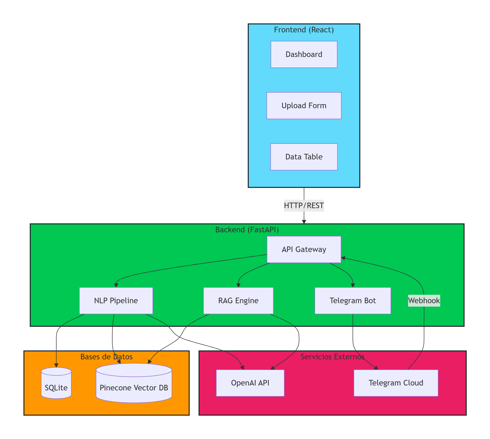

# Feedback Classifier IA - Sistema Inteligente de Análisis de Feedback

<div align="center">


**Un sistema híbrido que clasifica automáticamente feedback de clientes usando IA, con integración multi-canal y dashboard interactivo**

</div>

## 📋 Tabla de Contenidos
- [Descripción General](#descripción-general)
- [Características Principales](#características-principales)
- [Arquitectura del Sistema](#arquitectura-del-sistema)
- [Tecnologías Utilizadas](#tecnologías-utilizadas)
- [Estructura del Proyecto](#estructura-del-proyecto)
- [Instalación y Configuración](#instalación-y-configuración)
- [Uso del Sistema](#uso-del-sistema)
- [Endpoints API](#endpoints-api)
- [Integración con Telegram](#integración-con-telegram)
- [Sistema RAG](#sistema-rag)
- [Contribución](#contribución)
- [Licencia](#licencia)

## 🚀 Descripción General

**Feedback Classifier IA** es una plataforma inteligente que automatiza el análisis de feedback de clientes utilizando **Inteligencia Artificial** y **Procesamiento de Lenguaje Natural (NLP)**. El sistema permite recibir feedback desde múltiples canales (web, WhatsApp, Telegram, encuestas) y los clasifica automáticamente por:

- **Sentimiento**: positivo, negativo o neutral
- **Categoría**: producto, servicio, entrega, atención, precio, calidad, etc.
- **Urgencia**: alta, media o baja
- **Resumen**: generación automática de resúmenes ejecutivos

Además, incluye un **sistema RAG (Retrieval-Augmented Generation)** que permite realizar consultas inteligentes sobre los feedbacks y obtener recomendaciones accionables.

## ✨ Características Principales

### 🤖 IA y NLP
- **Clasificación automática** con GPT-4o-mini
- **Embeddings semánticos** con OpenAI text-embedding-3-small
- **Normalización avanzada de texto**: lowercasing, eliminación de caracteres especiales, conversión de emojis
- **Deduplicación inteligente** mediante hash SHA-256
- **Sistema RAG** para consultas contextuales

### 📊 Dashboard y Visualización
- **Gráficos interactivos** con Recharts
- **Métricas en tiempo real** por canal y categoría
- **Exportación a CSV** de todos los datos
- **Insights automáticos** generados por IA
- **Temas recurrentes** detectados automáticamente

### 🔌 Integración Multi-Canal
- **Web**: Formulario manual
- **Telegram**: Bot automático con webhook
- **WhatsApp**: Soporte para importación manual
- **Encuestas**: Integración flexible

### 🛡️ Calidad de Datos
- **Validación Pydantic** con reglas estrictas
- **Normalización de texto** (acentos, emojis, caracteres especiales)
- **Deduplicación automática** para evitar spam
- **Logging completo** de todas las operaciones

## 🏗️ Arquitectura del Sistema



### Flujo de Datos

1. **Entrada de Feedback**: El usuario envía feedback vía web o Telegram
2. **Normalización**: El texto se normaliza (lowercase, sin acentos, emojis a texto)
3. **Deduplicación**: Se verifica si el feedback ya existe mediante hash SHA-256
4. **Clasificación IA**: GPT-4o-mini analiza y clasifica el contenido
5. **Almacenamiento**: Se guarda en SQLite y se genera embedding en Pinecone
6. **Notificación**: Si es vía Telegram, se notifica al usuario y al admin
7. **Visualización**: El dashboard actualiza métricas e insights en tiempo real

## 💻 Tecnologías Utilizadas

### Backend
| Tecnología | Versión | Propósito |
|------------|---------|------------|
| **Python** | 3.9+ | Lenguaje principal |
| **FastAPI** | 0.104+ | Framework web async |
| **SQLAlchemy** | 2.0+ | ORM para base de datos |
| **SQLite** | 3.x | Base de datos ligera |
| **Pydantic** | 2.5+ | Validación de datos |
| **Uvicorn** | 0.24+ | Servidor ASGI |

### IA y ML
| Tecnología | Versión | Propósito |
|------------|---------|------------|
| **LangChain** | 0.1+ | Framework de orquestación IA |
| **OpenAI GPT-4o-mini** | - | Clasificación y generación |
| **OpenAI Embeddings** | text-embedding-3-small | Vectores semánticos |
| **Pinecone** | 3.0+ | Vector database |

### Frontend
| Tecnología | Versión | Propósito |
|------------|---------|------------|
| **React** | 18.2+ | Framework UI |
| **Axios** | 1.6+ | Cliente HTTP |
| **Recharts** | 2.10+ | Gráficos interactivos |
| **Framer Motion** | 10.16+ | Animaciones |
| **Tailwind CSS** | 3.3+ | Estilos utilitarios |
| **Lucide React** | 0.292+ | Iconos |

### Integración
| Tecnología | Versión | Propósito |
|------------|---------|------------|
| **HTTPX** | 0.25+ | Cliente HTTP async |
| **Ngrok** | - | Tunneling para webhooks |


## 📁 Estructura del Proyecto

```text
feedback-classifier/
│
├── backend/                          # Servidor backend
│   ├── app/                          # Código principal
│   │   ├── __init__.py
│   │   ├── main.py                   # Endpoints API y lógica principal
│   │   ├── models.py                 # Modelos SQLAlchemy (Base de datos)
│   │   ├── schemas.py                # Schemas Pydantic (Validación)
│   │   ├── database.py               # Configuración de BD
│   │   ├── pipeline.py               # Pipeline de IA (LangChain)
│   │   └── rag.py                    # Sistema RAG
│   │
│   ├── requirements.txt              # Dependencias Python
│   ├── .env                          # Variables de entorno
│   ├── feedback.db                   # Base de datos SQLite
│   └── migrate_db.py                 # Script de migración
│
├── front/                            # Cliente frontend
│   ├── public/
│   │   └── index.html                # HTML principal
│   │
│   ├── src/
│   │   ├── components/               # Componentes React
│   │   │   ├── Dashboard.js          # Dashboard principal
│   │   │   ├── FeedbackTable.js      # Tabla de feedbacks
│   │   │   ├── InsightsDashboard.js  # Insights avanzados
│   │   │   ├── UploadForm.js         # Formulario de carga
│   │   │   └── Header.js             # Header con navegación
│   │   │
│   │   ├── App.js                    # Componente principal
│   │   ├── index.js                  # Punto de entrada
│   │   └── index.css                 # Estilos globales (Tailwind)
│   │
│   ├── package.json                  # Dependencias Node
│   └── tailwind.config.js            # Configuración TailwindCSS
│
├── .gitignore                        # Archivos ignorados por Git
├── README.md                         # Documentación
└── LICENSE                           # Licencia MIT
```

## 🔧 Instalación y Configuración

### Prerrequisitos

- Python 3.9 o superior
- Node.js 16 o superior
- npm o yarn
- Cuenta de OpenAI API
- Cuenta de Pinecone
- Bot de Telegram (opcional)

### Paso 1: Clonar el repositorio

```bash
git clone https://github.com/tu-usuario/feedback-classifier.git
cd feedback-classifier
```

### Paso 2: Configurar el backend

Crear y activar entorno virtual
```
cd backend
python -m venv venv

# En Windows:
venv\Scripts\activate
# En Linux/Mac:
source venv/bin/activate

# Instalar dependencias
pip install -r requirements.txt
Paso 3: Configurar variables de entorno
```

### Paso 3: Configurar variables de entorno

Crea un archivo .env en backend/:
```
# OpenAI
OPENAI_API_KEY=sk-...

# Pinecone
PINECONE_API_KEY=...
PINECONE_INDEX_NAME=feedbacks

# Telegram (opcional)
TELEGRAM_BOT_TOKEN=...
ADMIN_CHAT_ID=...
```

### Paso 4: Inicializar la base de datos
```
bash
# Ejecutar migración
python migrate_db.py
```

### Paso 5: Configurar el frontend
```
bash
cd ../front
npm install
# o
yarn install
```

### Paso 6: Ejecutar la aplicación
Terminal 1 - Backend:

```
bash
cd backend
uvicorn app.main:app --reload --port 8000
```

Terminal 2 - Frontend:
```
bash
cd front
npm start
# o
yarn start
```

La aplicación estará disponible en:

Frontend: http://localhost:3000

Backend API: http://localhost:8000

Documentación API: http://localhost:8000/docs


📖 Uso del Sistema
1. Cargar Feedback Manual
Accede al formulario en el dashboard

Escribe o pega el feedback del cliente

Selecciona la fuente (Web/WhatsApp/Encuesta)

Haz clic en "Clasificar con IA"

Visualiza el resultado inmediato

2. Ver Dashboard de Insights
Métricas generales: Total de feedbacks por canal

Gráficos de sentimiento: Distribución positiva/negativa/neutral

Categorías principales: Bar chart interactivo

Temas recurrentes: Análisis automático de IA

Comparativas por canal: Web vs WhatsApp vs Telegram

3. Explorar Feedbacks
Tabla completa con todos los feedbacks clasificados

Filtrado y ordenamiento por columnas

Exportación a CSV para análisis externo

Visualización de resúmenes generados por IA

4. Integración con Telegram
```
bash
# Configurar webhook con ngrok
ngrok http 8000

# Configurar webhook en tu backend
curl "http://localhost:8000/set-webhook?ngrok_url=https://tu-url.ngrok-free.dev"
Ahora los usuarios pueden enviar feedback directamente a tu bot de Telegram.
```

## 🔌 Endpoints API

### Clasificación
| Método | Endpoint | Descripción |
| :--- | :--- | :--- |
| `POST` | `/clasificar` | Clasificar un feedback manual |
| `POST` | `/webhook/telegram` | Webhook para Telegram |
| `GET` | `/set-webhook` | Configurar webhook de Telegram |

### Consultas
| Método | Endpoint | Descripción |
| :--- | :--- | :--- |
| `GET` | `/insights` | Obtener métricas y análisis |
| `GET` | `/insights/avanzado` | Insights con estadísticas detalladas |
| `GET` | `/feedbacks` | Listar todos los feedbacks |
| `GET` | `/mensajes` | Filtrar solo mensajes de Telegram |
| `GET` | `/export/csv` | Exportar datos a CSV |

### Sistema RAG
| Método | Endpoint | Descripción |
| :--- | :--- | :--- |
| `POST` | `/rag/consultar` | Consultar tendencias con IA |
| `GET` | `/rag/tendencias` | Análisis de tendencias automático |
| `GET` | `/rag/recomendaciones` | Recomendaciones accionables |
| `GET` | `/rag/buscar/{tema}` | Búsqueda semántica por tema |

### Utilidades
| Método | Endpoint | Descripción |
| :--- | :--- | :--- |
| `POST` | `/check-duplicate` | Verificar si un feedback es duplicado |

---

## 💡 Ejemplos de uso

### Clasificar feedback
```bash
curl -X POST http://localhost:8000/clasificar \
  -H "Content-Type: application/json" \
  -d '{"texto":"Excelente atención al cliente, muy rápido","fuente":"web"}'
```

# Consultar RAG
```
curl -X POST http://localhost:8000/rag/consultar \
  -H "Content-Type: application/json" \
  -d '{"query":"¿Qué opinan los clientes sobre el tiempo de entrega?"}'
```

# Exportar datos
```
curl http://localhost:8000/export/csv --output feedbacks.csv
```


🤖 Sistema RAG
El sistema RAG permite realizar consultas inteligentes sobre el conjunto de feedbacks:

Características
Búsqueda semántica: Encuentra feedbacks relevantes por significado, no solo palabras clave

Contexto aumentado: La IA responde basándose en feedbacks reales

Recomendaciones accionables: Sugerencias automáticas para mejorar

Ejemplos de consultas
python
# ¿Qué problemas son más frecuentes?
query = "¿Cuáles son los principales problemas que reportan los clientes?"

# Análisis de sentimiento por producto
query = "¿Cómo se sienten los clientes sobre el producto X?"

# Recomendaciones de mejora
query = "¿Qué acciones podemos tomar para reducir los feedbacks negativos?"


🔐 Variables de Entorno
Variable	Requerida	Descripción
OPENAI_API_KEY	✅	API key de OpenAI
PINECONE_API_KEY	✅	API key de Pinecone
PINECONE_INDEX_NAME	✅	Nombre del índice (default: "feedbacks")
TELEGRAM_BOT_TOKEN	❌	Token del bot de Telegram
ADMIN_CHAT_ID	❌	Chat ID del administrador


📊 Base de Datos
Esquema SQLite
sql
CREATE TABLE feedbacks (
    id INTEGER PRIMARY KEY,
    texto TEXT NOT NULL,
    texto_normalizado TEXT,
    texto_hash VARCHAR(64) UNIQUE,
    fuente VARCHAR(50),
    fecha DATETIME,
    sentimiento VARCHAR(20),
    categoria VARCHAR(100),
    urgencia VARCHAR(20),
    resumen TEXT,
    embedding_id VARCHAR(100)
);

CREATE INDEX ix_feedbacks_texto_hash ON feedbacks(texto_hash);
CREATE INDEX ix_feedbacks_fecha ON feedbacks(fecha);


🤝 Contribución
Las contribuciones son bienvenidas. Por favor:

Fork el proyecto

Crea tu rama (git checkout -b feature/AmazingFeature)

Commit tus cambios (git commit -m 'Add some AmazingFeature')

Push a la rama (git push origin feature/AmazingFeature)

Abre un Pull Request

Guías de Contribución
Sigue el estilo de código PEP 8 para Python

Usa componentes funcionales y hooks en React

Escribe tests para nuevas funcionalidades

Actualiza la documentación según sea necesario


🙏 Agradecimientos
OpenAI por sus modelos de IA

LangChain por el framework de orquestación

FastAPI por el excelente framework

React y la comunidad por las herramientas increíbles


